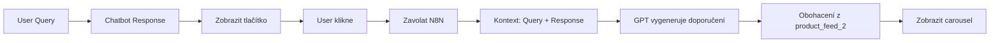

# Produktové doporučení na tlačítko

## 📋 Přehled

Nová funkce pro chatboty, která zobrazí tlačítko **"Doporučit produkty"** na konci odpovědi chatbota. Po kliknutí na tlačítko se zavolá N8N webhook, který vygeneruje personalizované produktové doporučení na základě kontextu konverzace.

## 🎯 Jak to funguje

### 1. **Uživatel se zeptá**
```
👤 User: "Potřebuji něco na bolest hlavy"
```

### 2. **Chatbot odpoví**
```
🤖 Bot: "Pro bolest hlavy doporučuji následující..."
```

### 3. **Zobrazí se tlačítko**
```
[💊 Doporučit produkty]  ← Tlačítko na konci odpovědi
```

### 4. **Po kliknutí**
- Zavolá se N8N webhook s kontextem:
  - Poslední dotaz uživatele
  - Aktuální odpověď chatbota
  - Session ID pro kontext
- N8N vygeneruje carousel s produkty
- Každý produkt má personalizované doporučení

## 🔧 Implementace

### Databáze

**Nový sloupec v `chatbot_settings`:**
```sql
product_button_recommendations BOOLEAN DEFAULT false
```

**Migrace:**
```bash
# Spusť SQL script
psql < add_product_button_recommendations.sql
```

### Administrace

**Nastavení v ChatbotManagement:**

```
🔧 Základní funkce
  ☐ Produktová doporučení
  ☐ Produktové doporučení na tlačítko  ← NOVÉ
  ☐ Databáze knih
```

### API Integrace

**Service:** `productButtonRecommendationService.ts`

```typescript
import { getButtonProductRecommendations } from '@/services/productButtonRecommendationService';

// Získej doporučení na základě kontextu konverzace
const result = await getButtonProductRecommendations({
  userQuery: "Potřebuji něco na bolest hlavy",
  botResponse: "Pro bolest hlavy doporučuji...",
  sessionId: "session-123"
});

// result = {
//   text: "Na základě konverzace jsem pro vás vybral 6 produktů:",
//   products: [...]
// }
```

## 📡 N8N Webhook

### Endpoint
```
POST https://n8n.srv980546.hstgr.cloud/webhook/BUTTON-RECOMMENDATIONS-ID
```

### Request Body
```json
{
  "userQuery": "Potřebuji něco na bolest hlavy",
  "botResponse": "Pro bolest hlavy doporučuji následující přístupy...",
  "session_id": "session-abc123",
  "timestamp": "2025-11-26T10:30:00.000Z"
}
```

### Response Format

Service podporuje **3 varianty** odpovědi z N8N (stejně jako Product Chat):

#### Varianta 1: Pole s objektem
```json
[
  {
    "data": [
      {
        "ID produktu": "2737",
        "Doporuceni": "Tato směs je ideální pro..."
      }
    ]
  }
]
```

#### Varianta 2: Objekt s data ✅ (preferovaná)
```json
{
  "data": [
    {
      "ID produktu": "2318",
      "Doporuceni": "Pomáhá při..."
    },
    {
      "ID produktu": "2956",
      "Doporuceni": "Podporuje..."
    }
  ]
}
```

#### Varianta 3: Standardní formát
```json
{
  "text": "Na základě konverzace jsem pro vás vybral 5 produktů:",
  "products": [
    {
      "product_code": "2318",
      "recommendation": "Pomáhá při..."
    }
  ]
}
```

**Poznámka:** Service automaticky konvertuje všechny varianty na standardní formát.

## 🔄 Workflow



## 📊 Data Flow

### 1. Kontext do N8N
```typescript
{
  userQuery: "poslední dotaz uživatele",
  botResponse: "aktuální odpověď chatbota",
  session_id: "session-id"
}
```

### 2. Response z N8N
```typescript
{
  text: "Vygenerovaný text",
  products: [
    { product_code: "2318", recommendation: "Personalizované doporučení" }
  ]
}
```

### 3. Obohacení metadat
```typescript
// Načtení z product_feed_2
{
  product_code: "2318",
  product_name: "Wan 015",
  recommendation: "Personalizované doporučení",  // ⭐ Z N8N
  url: "https://bewit.love/produkt/...",
  image_url: "https://...",
  price: 189,
  currency: "CZK"
}
```

### 4. Zobrazení v UI
```jsx
<ProductCarousel 
  products={enrichedProducts}
  title="Doporučené produkty"
/>
```

## 🎨 UI Komponenta (příklad)

```tsx
// Po kliknutí na tlačítko
const handleRecommendClick = async () => {
  const result = await getButtonProductRecommendations({
    userQuery: lastUserQuery,
    botResponse: currentBotResponse,
    sessionId: sessionId
  });

  // Zobrazit produkty v carousel
  setProducts(result.products);
};

// Tlačítko v odpovědi chatbota
<button onClick={handleRecommendClick}>
  💊 Doporučit produkty
</button>
```

## 🔍 Rozdíl oproti běžnému produktovému doporučení

| Funkce | Běžné produktové doporučení | Button doporučení |
|--------|----------------------------|-------------------|
| **Kdy se zobrazí** | Automaticky v každé odpovědi | Na tlačítko |
| **Kontext** | Pouze user query | User query + Bot response |
| **Použití** | Okamžitá doporučení | Kontextová doporučení |
| **Vhodné pro** | Přímé dotazy na produkty | Obecné dotazy + návazná doporučení |

## ✅ Testování

### Test webhook
```typescript
import { testButtonRecommendationsWebhook } from '@/services/productButtonRecommendationService';

const success = await testButtonRecommendationsWebhook();
console.log('Test:', success ? '✅' : '❌');
```

### Manuální test
1. Přejdi do **Správy chatbotů**
2. Zapni **"Produktové doporučení na tlačítko"** pro chatbota
3. Ulož nastavení
4. Otevři chat
5. Napiš dotaz (např. "bolest hlavy")
6. Počkej na odpověď chatbota
7. Klikni na tlačítko **"Doporučit produkty"**
8. Zkontroluj zobrazení carousel s produkty

## 📝 N8N Workflow Setup

### Požadavky pro N8N workflow:
1. **Webhook Trigger** - Přijímá `userQuery`, `botResponse`, `session_id`
2. **GPT Node** - Analyzuje kontext a vybírá produkty
3. **Supabase Query** - Načítá produkty z `product_feed_2`
4. **Response Format** - Vrací seznam produktů s doporučeními

### Prompt pro GPT (příklad):
```
Uživatel se zeptal: "{userQuery}"
Chatbot odpověděl: "{botResponse}"

Na základě tohoto kontextu vyber 5-6 nejvhodnějších produktů z databáze
a pro každý produkt napiš personalizované doporučení (2-3 věty).
```

## 🚀 Deployment

### 1. Database Migration
```bash
psql -h db.supabase.co -U postgres -d postgres < add_product_button_recommendations.sql
```

### 2. N8N Webhook
1. Vytvoř nový N8N workflow
2. Zkopíruj webhook URL
3. Aktualizuj `BUTTON_RECOMMENDATIONS_WEBHOOK_URL` v `productButtonRecommendationService.ts`

### 3. Frontend Deploy
```bash
npm run build
npm run deploy
```

## 🐛 Troubleshooting

### Tlačítko se nezobrazuje
- ✅ Zkontroluj, že je funkce zapnutá v nastavení chatbota
- ✅ Refresh stránky po změně nastavení

### Webhook fails
- ✅ Zkontroluj N8N webhook URL
- ✅ Zkontroluj N8N workflow status (musí být active)
- ✅ Zkontroluj console logs v prohlížeči

### Produkty se nezobrazují
- ✅ Zkontroluj `product_feed_2` tabulku v Supabase
- ✅ Zkontroluj, že produkty mají správné `product_code`
- ✅ Zkontroluj RLS policies na `product_feed_2`

## 📚 Související dokumentace

- [Product Chat Implementation](./PRODUCT_CHAT_IMPLEMENTATION.md)
- [N8N Response Format](./N8N_RESPONSE_FORMAT.md)
- [Chatbot Settings Service](./src/services/chatbotSettingsService.ts)
- [Product Button Recommendation Service](./src/services/productButtonRecommendationService.ts)

## 🎯 Status

✅ **Database interface aktualizován**  
✅ **UI v ChatbotManagement přidáno**  
✅ **Service vytvořen**  
✅ **SQL migration připraven**  
⚠️ **N8N webhook URL potřebuje být nakonfigurován**  
⚠️ **UI komponenta tlačítka potřebuje být implementována v chatbot UI**

---

**Vytvořeno:** 2025-11-26  
**Autor:** AI Assistant  
**Verze:** 1.0

