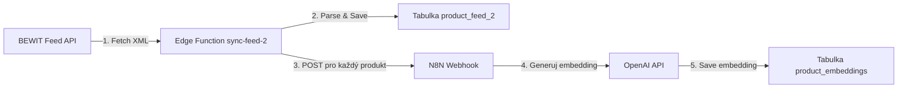
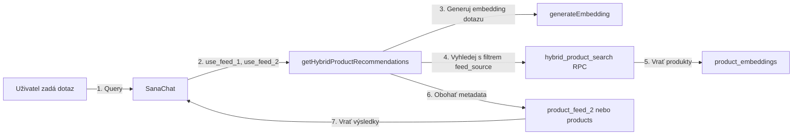

# Product Feed 2 - Implementace Nového Feedu

## Přehled

Tento dokument popisuje implementaci nového produktového feedu **Product Feed 2** pro systém BEWIT. Nový feed má odlišnou XML strukturu a je plně integrován s vektorovou databází pro sémantické vyhledávání.

## Struktura Nového Feedu

### URL Feedu
```
https://bewit.love/feed/bewit?auth=xr32PRbrs554K
```

### XML Struktura
```xml
<ITEM>
  <ID>2347</ID>
  <PRODUCTNAME>009 - Čistý dech</PRODUCTNAME>
  <DESCRIPTION_SHORT>Krátký popis produktu...</DESCRIPTION_SHORT>
  <DESCRIPTION_LONG>Detailní popis produktu s markdown formátováním...</DESCRIPTION_LONG>
  <CATEGORYTEXT id="343">TČM - Tradiční čínská medicína</CATEGORYTEXT>
  <URL>https://bewit.love/produkt/bewit-cisty-dech</URL>
  <THUMBNAIL>https://bewit.love/images/products/...</THUMBNAIL>
  <AVAIBILITY>1</AVAIBILITY>
  <PRICE>175</PRICE>
  <IN_ACTION>0</IN_ACTION>
  <SALES_LAST_30_DAYS>6</SALES_LAST_30_DAYS>
</ITEM>
```

## Implementované Komponenty

### 1. Databázové Schéma

**Soubor:** `create_product_feed_2_table.sql`

#### Nová Tabulka: `product_feed_2`
- `id` - Primární klíč
- `product_code` - Unikátní kód produktu (z ID)
- `product_name` - Název produktu (z PRODUCTNAME)
- `description_short` - Krátký popis
- `description_long` - Detailní popis
- `category` - Kategorie produktu
- `url` - URL produktu
- `thumbnail` - Obrázek produktu
- `price` - Cena
- `currency` - Měna (CZK)
- `availability` - Dostupnost
- `in_action` - Zda je produkt v akci
- `sales_last_30_days` - Prodeje za posledních 30 dní
- `sync_status` - Stav synchronizace
- `last_sync_at` - Datum poslední synchronizace

#### Rozšíření Tabulky: `product_embeddings`
- `feed_source` VARCHAR - Rozlišení zdroje ('feed_1' nebo 'feed_2')
- `description_short` TEXT - Krátký popis pro Feed 2
- `description_long` TEXT - Dlouhý popis pro Feed 2

### 2. Edge Function pro Synchronizaci

**Soubor:** `supabase/functions/sync-feed-2/index.ts`

Kompletně nová Edge Function, která:
1. Stáhne XML feed z BEWIT API
2. Parsuje novou XML strukturu
3. Uloží produkty do tabulky `product_feed_2`
4. Automaticky volá n8n webhook pro každý produkt
5. n8n vytvoří embeddings z `description_short` a `description_long`

**Deployment:**
```bash
supabase functions deploy sync-feed-2
```

### 3. N8N Webhook Služba

**Soubor:** `src/services/n8nProductEmbeddingService.ts`

Služba pro komunikaci s n8n webhook:
- **URL:** `https://n8n.srv980546.hstgr.cloud/webhook/3890ccdd-d09f-461b-b409-660d477023a3`
- **Payload:** `{ product_code, product_name, description_short, description_long, feed_source: 'feed_2' }`
- n8n vytvoří embedding a uloží do `product_embeddings`

### 4. Hybridní Vyhledávání

**Soubor:** `src/services/hybridProductService.ts`

Implementuje skutečné hybridní vyhledávání:
1. Vygeneruje embedding z dotazu uživatele
2. Volá `hybrid_product_search()` nebo `search_products_by_vector()` RPC funkce
3. Filtruje podle `feed_source` (feed_1, feed_2, nebo obě)
4. Obohacuje výsledky o aktuální metadata z příslušných tabulek
5. Vrací kombinovaná data pro zobrazení v chatbotu

### 5. SQL Funkce pro Vyhledávání

**Soubor:** `update_hybrid_search_for_feed_2.sql`

Aktualizované SQL funkce:
- `search_products_by_vector()` - s parametrem `filter_feed_source`
- `hybrid_product_search()` - s parametrem `filter_feed_source`
- `get_product_chunks_for_rag()` - s parametrem `filter_feed_source`
- `search_products_by_feed()` - nová funkce pro vyhledávání podle feedu

### 6. Automatická Synchronizace

**Soubor:** `setup_cron_feed_2.sql`

Denní cron job:
- Spouští se každý den ve **2:00 UTC**
- Volá Edge Function `sync-feed-2`
- Loguje výsledky do tabulky `sync_logs`

**Nastavení v Supabase Dashboard:**
1. Database > Cron Jobs
2. Create new cron job
3. Schedule: `0 2 * * *`
4. Command: HTTP POST na Edge Function

### 7. UI Komponenta

**Soubor:** `src/components/SanaChat/ProductSync.tsx`

Aktualizovaná komponenta s:
- **Výběr feedu:** Tabs pro přepínání mezi Feed 1 a Feed 2
- **Statistiky:** Počet produktů, stav poslední synchronizace
- **Tlačítko "Synchronizovat Feed 2 nyní"** pro manuální spuštění
- Oddělené zobrazení pro každý feed

### 8. Chatbot Nastavení

**Soubor:** `src/services/chatbotSettingsService.ts`

Nové vlastnosti v `ChatbotSettings`:
- `use_feed_1?: boolean` - Zda chatbot používá Feed 1
- `use_feed_2?: boolean` - Zda chatbot používá Feed 2

**SQL Migrace:** `add_feed_source_settings_to_chatbot.sql`

## Workflow

### Synchronizace Feed 2



### Vyhledávání v Chatbotu



## Použití

### Manuální Synchronizace

1. Přihlaste se jako admin
2. Přejděte na "Správa produktů"
3. Vyberte tab "Feed 2 - Product Feed 2"
4. Klikněte na "🔄 Synchronizovat Feed 2 nyní"

### Nastavení Chatbota

V administraci chatbota můžete nastavit, které feedy má používat:

```typescript
{
  product_recommendations: true,
  use_feed_1: true,  // Použít zbozi.xml
  use_feed_2: true   // Použít Product Feed 2
}
```

### Programové Použití

```typescript
import { getHybridProductRecommendations } from './services/hybridProductService';

// Vyhledávání v obou feedech
const products = await getHybridProductRecommendations(
  'produkt na nachlazení',
  sessionId,
  10,
  true,  // use Feed 1
  true   // use Feed 2
);

// Pouze Feed 2
const productsFromFeed2 = await getHybridProductRecommendations(
  'tradiční čínská medicína',
  sessionId,
  10,
  false, // nepoužít Feed 1
  true   // použít Feed 2
);
```

## Spuštění SQL Migrací

V uvedeném pořadí:

```bash
# 1. Vytvoření tabulek a rozšíření product_embeddings
psql -f create_product_feed_2_table.sql

# 2. Aktualizace SQL funkcí pro vyhledávání
psql -f update_hybrid_search_for_feed_2.sql

# 3. Přidání nastavení do chatbot_settings
psql -f add_feed_source_settings_to_chatbot.sql

# 4. Nastavení cron jobu (upravte URL a klíč před spuštěním!)
psql -f setup_cron_feed_2.sql
```

## Testování

### 1. Test Synchronizace

```bash
# Zavolejte Edge Function manuálně
curl -X POST \
  https://YOUR_PROJECT_REF.supabase.co/functions/v1/sync-feed-2 \
  -H "Authorization: Bearer YOUR_ANON_KEY" \
  -H "Content-Type: application/json"
```

### 2. Test Vyhledávání

```sql
-- Test vektorového vyhledávání v Feed 2
SELECT * FROM search_products_by_vector(
  (SELECT embedding FROM product_embeddings LIMIT 1), -- test embedding
  0.5,
  10,
  'feed_2'
);

-- Test hybridního vyhledávání
SELECT * FROM hybrid_product_search(
  'čistý dech',
  (SELECT embedding FROM product_embeddings LIMIT 1),
  10,
  1.0,
  1.0,
  50,
  'feed_2'
);
```

### 3. Test N8N Webhooku

```typescript
import { testN8nWebhook } from './services/n8nProductEmbeddingService';

const success = await testN8nWebhook();
console.log('N8N test:', success);
```

## Monitoring

### Kontrola Sync Logů

```sql
SELECT * FROM sync_logs 
WHERE sync_type = 'product_feed_2'
ORDER BY started_at DESC 
LIMIT 10;
```

### Kontrola Počtu Produktů

```sql
-- Feed 1
SELECT COUNT(*) FROM products;

-- Feed 2
SELECT COUNT(*) FROM product_feed_2;

-- Embeddings podle zdroje
SELECT feed_source, COUNT(*) 
FROM product_embeddings 
GROUP BY feed_source;
```

### Kontrola Cron Jobu

```sql
-- Seznam cron jobů
SELECT * FROM cron.job WHERE jobname LIKE '%feed%';

-- Historie spuštění
SELECT * FROM cron.job_run_details 
WHERE jobid = (
  SELECT jobid FROM cron.job 
  WHERE jobname = 'sync-product-feed-2-daily'
)
ORDER BY start_time DESC 
LIMIT 10;
```

## Řešení Problémů

### Edge Function Selhává

1. Zkontrolujte logy: Supabase Dashboard > Edge Functions > sync-feed-2 > Logs
2. Ověřte, že feed URL je dostupný
3. Zkontrolujte, že tabulka `product_feed_2` existuje

### N8N Webhook Nefunguje

1. Test URL v prohlížeči nebo Postman
2. Zkontrolujte formát payload
3. Ověřte, že n8n workflow je aktivní

### Vyhledávání Nevrací Výsledky

1. Zkontrolujte, že embeddingy byly vytvořeny:
```sql
SELECT COUNT(*) FROM product_embeddings 
WHERE feed_source = 'feed_2' AND embedding IS NOT NULL;
```

2. Zkontrolujte chatbot nastavení:
```sql
SELECT use_feed_1, use_feed_2 FROM chatbot_settings;
```

3. Zkuste snížit `similarity_threshold` v SQL funkcích

## Bezpečnost

- Feed URL obsahuje autentizační token v query parametru
- Edge Function používá service_role_key pro zápis do DB
- N8N webhook je veřejný, ale neobsahuje citlivá data
- RLS policies jsou nastaveny na tabulce `product_feed_2`

## Performance

- Denní synchronizace běží v době nízké zátěže (2:00 UTC)
- Produkty se zpracovávají po dávkách (50 produktů najednou)
- Embeddingy se ukládají asynchronně přes n8n
- SQL funkce používají indexy pro rychlé vyhledávání

## Budoucí Vylepšení

1. **Ranking podle prodejů:** Využití `sales_last_30_days` pro prioritizaci produktů
2. **Real-time aktualizace:** Webhook od BEWIT při změně produktu
3. **Caching:** Redis cache pro často vyhledávané produkty
4. **A/B Testing:** Porovnání výkonnosti Feed 1 vs Feed 2
5. **Analytics:** Sledování, které produkty jsou nejčastěji doporučovány

## Podpora

Pro technické dotazy kontaktujte development team nebo vytvořte issue v repository.

---

**Vytvořeno:** 25. listopadu 2024  
**Verze:** 1.0  
**Autor:** AI Assistant


