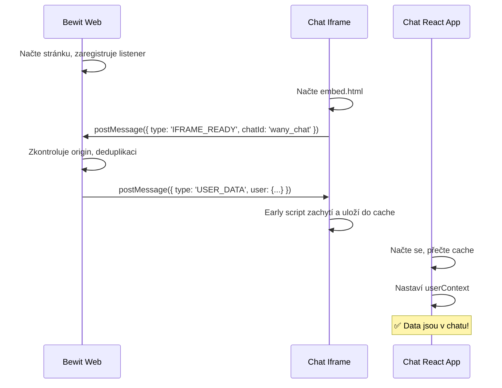

# 🎯 Bewit Intelligence - Integrace pro klienta

## 📦 Co dostáváte

### ✅ 3 soubory:

1. **`KLIENT_INTEGRACE_OBA_CHATY.html`** - Kompletní kód pro copy-paste
2. **`KLIENT_INTEGRACE_INSTRUKCE.md`** - Detailní návod s vysvětlením
3. **Test stránka:** https://gr8learn.eu/test-klient-integrace.html

---

## ⚡ Rychlý start (5 minut)

### Krok 1: Otevři `KLIENT_INTEGRACE_OBA_CHATY.html`

Tento soubor obsahuje **kompletní kód** pro oba chatboty.

### Krok 2: Uprav PHP část (user data)

Najdi tento blok na začátku souboru:

```javascript
const CURRENT_USER = {
    id: '<?php echo $user->id; ?>',
    email: '<?php echo $user->email; ?>',
    firstName: '<?php echo $user->firstName; ?>',
    lastName: '<?php echo $user->lastName; ?>',
    position: '<?php echo $user->bbo?.bbo_position_id ? BBO_POSITIONS[$user->bbo->bbo_position_id] : ""; ?>',
    tokenEshop: '<?php echo $user->bewitToken; ?>'
};
```

Uprav PHP výrazy podle **vašeho backendu** (Laravel/Blade/čistý PHP).

### Krok 3: Zkopíruj celý kód na svůj web

Zkopíruj celý obsah `KLIENT_INTEGRACE_OBA_CHATY.html` do vaší stránky.

### Krok 4: Test

1. Otevři stránku s chaty
2. Otevři Developer Tools (F12) → Console
3. Měl bys vidět:
   ```
   ✅ Globální IFRAME_READY listener zaregistrován
   ```
4. Klikni na "Spustit Chat"
5. Měl bys vidět:
   ```
   ✅ IFRAME_READY přijato z chatu: wany_chat
   📤 User data poslána do wany_chat
   ```
6. V iframe konzoli (otevři iframe v DevTools):
   ```
   🔥 ZPRÁVA: { type: "USER_DATA", user: {...} }
   ✅ DATA ZACHYCENA
   ```

---

## 🔍 Co se změnilo oproti původnímu kódu?

### ❌ ODSTRANĚNO (STARÝ kód):

```javascript
// ❌ Toto SMAZAT ze všech chatů:
<script>
(function() {
  const iframe = document.getElementById('wany-chat-iframe');
  if (!iframe) return;
  iframe.addEventListener('load', function() {
    iframe.contentWindow.postMessage({
      type: 'USER_DATA',
      user: { /* ... */ }
    }, 'https://gr8learn.eu');
  });
})();
</script>
```

**Proč:** Posílá data v nesprávný okamžik, může poslat 2×, může trefit špatný iframe.

---

### ✅ PŘIDÁNO (NOVÝ kód):

```javascript
// ✅ Globální listener (vložit JEN JEDNOU na stránku):
<script>
(function() {
  const GR8_ORIGIN = 'https://gr8learn.eu';
  const sentTo = new WeakSet();

  window.addEventListener('message', function(event) {
    if (event.origin !== GR8_ORIGIN) return;
    if (!event.data || event.data.type !== 'IFRAME_READY') return;
    if (!event.source || sentTo.has(event.source)) return;

    const userData = { type: 'USER_DATA', user: CURRENT_USER };
    event.source.postMessage(userData, event.origin);
    sentTo.add(event.source);
  });
})();
</script>
```

**Proč:** 
- ✅ Posílá data ve správný okamžik (když iframe řekne "jsem ready")
- ✅ Posílá přesně do správného iframe (přes `event.source`)
- ✅ Deduplikace (pošle jen 1× do každého iframe)
- ✅ Funguje pro oba chaty automaticky

---

## 📊 Jak to funguje



---

## 🧪 Testování

### Online test:
👉 **https://gr8learn.eu/test-klient-integrace.html**

Otevři tuto stránku a vyzkoušej oba chaty. Sleduj konzoli a uvidíš všechny kroky komunikace.

### Lokální test:
```bash
# Pokud máš přístup k repo:
npm run dev
# Otevři: http://localhost:5173/test-klient-integrace.html
```

---

## ✅ Checklist

- [ ] Upravil jsem PHP výrazy pro získání user dat
- [ ] Zkopíroval jsem globální listener (JEN JEDNOU na stránku)
- [ ] ODSTRANIL jsem všechny staré `iframe.addEventListener('load', ...)`
- [ ] Zkopíroval jsem Wany Chat sekci
- [ ] Zkopíroval jsem EO Směsi Chat sekci
- [ ] Otestoval jsem v konzoli - vidím `✅ IFRAME_READY přijato`
- [ ] Otestoval jsem oba chaty - user data jsou vyplněná
- [ ] Zkontroloval jsem N8N webhook - data tam jsou

---

## ❓ FAQ

### Musím měnit CSS/styling chatů?
**NE!** Vše zůstává stejné, měníme jen způsob posílání user dat.

### Musím měnit open/close funkce?
**NE!** `openWanyChat()`, `closeWanyChat()` atd. zůstávají beze změn.

### Kde vložím globální listener?
Nejlépe **hned po definici `CURRENT_USER`**, před HTML kód obou chatů.

### Co když mám jen jeden chat?
Funguje to stejně! Listener je univerzální pro oba chaty.

### Pošlou se data 2×?
**NE!** Díky deduplikaci (`WeakSet`) se pošlou jen **1× do každého iframe**.

### Co když otevřu a zavřu chat vícekrát?
Data se pošlou jen **při prvním načtení iframe**. Otevření/zavření modalu nemá vliv.

### Musím něco změnit na gr8learn.eu?
**NE!** Vše už je hotové a nasazené na naší straně.

---

## 🔒 Bezpečnost

### Origin check
```javascript
if (event.origin !== 'https://gr8learn.eu') return;
```
Listener přijímá zprávy **POUZE** z našeho serveru.

### Deduplikace
```javascript
if (sentTo.has(event.source)) return;
```
Data se pošlou **JEN JEDNOU** do každého iframe.

### event.source
```javascript
event.source.postMessage(...)
```
Posílá **PŘESNĚ** do toho iframe, které READY poslalo.

---

## 🆘 Podpora

Pokud něco nefunguje:

1. **Zkontroluj konzoli parent stránky:**
   - Hledej: `✅ Globální IFRAME_READY listener zaregistrován`
   - Hledej: `✅ IFRAME_READY přijato z chatu: ...`
   - Hledej: `📤 User data poslána do ...`

2. **Zkontroluj konzoli iframe:**
   - Otevři DevTools → najdi iframe v Elements
   - Pravý klik → "Inspect" na iframe
   - V Console hledej: `🔥 ZPRÁVA:`, `✅ DATA ZACHYCENA`

3. **Zkontroluj N8N webhook:**
   - Pošli testovací zprávu v chatu
   - Zkontroluj webhook log
   - Měl by obsahovat pole `user` s daty

4. **Pošli screenshot:**
   - Screenshot konzole parent stránky
   - Screenshot konzole iframe
   - Screenshot N8N logu (pokud je problém s daty)

---

## 📞 Kontakt

- **Email:** podpora@gr8learn.eu
- **Test stránka:** https://gr8learn.eu/test-klient-integrace.html

---

**🎉 Po implementaci bude integrace 100% spolehlivá!**

**Verze:** 2.0  
**Datum:** 2. února 2026  
**Status:** ✅ Production Ready
